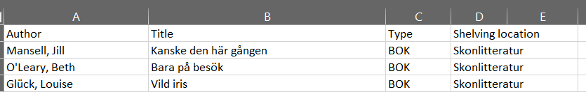
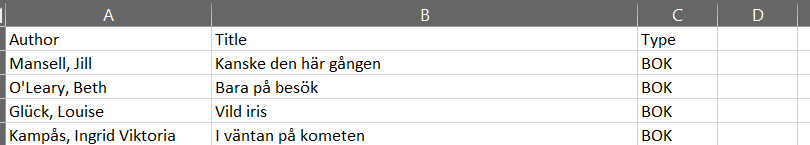

# MARCtoXLS  

## What am I supposed to do with this?  
This is meant as a tool for converting MARC21 lists to Excel format, for easier handling.  
Maybe you'll want to create some folder about new procurements or something like that, and if you have a list in for example Koha you can probably export it in MAR21 format.  
And then this tool can be your friend!

I've based it on the great work from [afrozenpeach](https://github.com/afrozenpeach/CSharp_MARC) as a base, and then added (within .\Extensions\LibraryHelper.cs) the SwiftExcel stuff, and some support for filtering out placement from a specific Library (or a set of).

An example list `shelf.iso2709` in MARC21 format is included in the subfolder Testfiles.

## Usage  

No matter if you want to clone this repository and run it from code, or if you just want to run the pre compiled binary version, you will need to configure some things for it to work as per your needs.  

### Configuration options  

All configuration is made in the [appsettings.json](./appsettings.json) file, and here is an example config file with all the available options:  
```json
{    
        "placementDataFilter": [
            "TORE",
            "8BYI",
            "8BYS"
        ],
        "sourcePath": "D:\\Transfer\\In",
        "sourceFileFilter":"*.iso2709",
        "destinationPath": "D:\\Transfer\\Out",
        "archiveSourceFile": true,
        "archivePath":"D:\\Transfer\\In\\Archive"
}
```

#### Options explained  

##### placementDataFilter  
*(optional)*

This is an optional array of strings that you can use if you want to display where the items are placed in your library of choice. If this array is empty or not set at all in the config, there will be no column for Placement in the Excelfile.
If you set it, a lookup will be made for each item if it has placement data (MARC21 field: 952c) for a permanent location that matches the value in the filter (MARC21 field: 952a), then it will use that data for placement.

In the example configuration above we have specified three different locations in the array.  
These values are checked in the order they are entered in the array, and if there is a match for the first location, placement data will be used from that item, and the next location in the filter will be ignored. If there is no match for the first location filter, the next one will be tried. If there are no matches found for the locations, no placement data will be entered for that item in the Excelfile.  

Below is a screenshot from using the example configuration, with the MARC21 file from [/Testfiles](./Testfiles). In this case all the items have had matches from the first value in the filter array (Töreboda library)



And here is an example where we have processed the same MAR21 file, but omitted the filter from the config.  



##### sourcePath  

\[string\] *(mandatory)*  
This is the path where the source files are placed, the MARC21 files that should be converted to XLSX-format.  
Note that files will be removed after processing.  
You have the option to archive the processed files, see below.  

##### sourceFileFilter  

\[string\] *(mandatory)*  
This is the file mask that should be used to locate which files in the sourcePath that should be processed. For example \*.iso2709 (or \*.\* if you are bold enough).  

##### destinationPath  

\[string\] *(mandatory)*  
This is the path where the XSLX-files should be exported to, simple as that.  

##### archiveSourceFile  

\[bool\] *(mandatory)*  
This boolean decides if the archived copies of the processed source files should be stored under the archivePath specified as per below.  

##### archivePath  

\[string\] *(conditionally mandatory)*  
If you set the boolean archiveSourceFile to true, this option needs to contain a valid path to the directory where you want the archived files to be stored. If the boolean is set to false, this value is not needed.  

### How to proceed from here  

Either you clone this repository, and run from the code. Or even better, improve the code? Feel free to make Pull Requests if you find something that you think my project needs or could use.  

The other option is to just download the binaries, they are in [/Binaries/Binaries.zip](./Binaries/Binaries.zip)
You can unzip the files to any location of your choice, configure it via the appsettings.json and just run the `Csharp_Marc.exe` file (or even run the DLL `dotnet .\CSharp_MARC.dll`)
The binaries have been compiled and tested on Windows x64 platform, and the source code has only been tested on Windows x64.